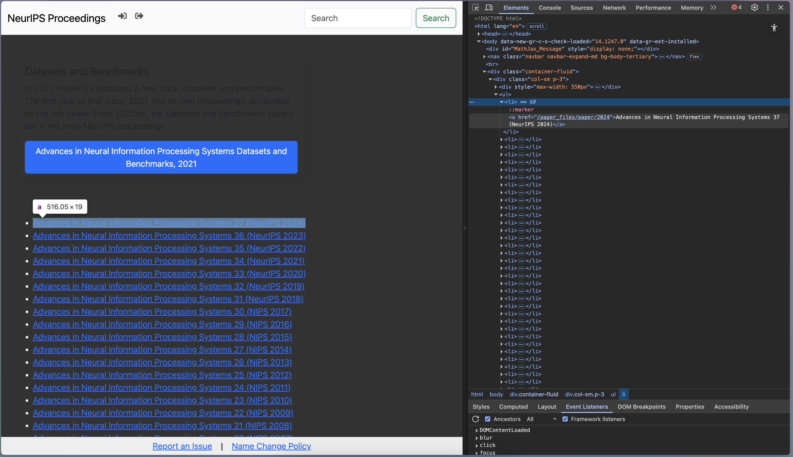

# NeurIPIS Dataset (1987-2024)
This project is developed out of curiosity. I'm curious about the number of papers accepted into NeurIPS over time and the most prominent topics each year. I will use `beautifulsoup` to scrape the abstract of all papers and implement some analyses like topic modeling or clustering to explore what's interesting about the data. The total number of papers accepted is **24,780**

## Web Scraper Tutorial
### Step 1: Inspect & Collect Proceedings Links
**Inspect** the main webpage and define the links or the elements that need to be extracted. 

Below is the main page of the NeurIPS Proceedings (https://papers.nips.cc/), which consists of links to all the papers and their abstract in a specific year. As a result, we first need to collect all these links so that we can visit each of them and extract the data from there.

Notice that the list of all the proceeding links is within the element `div` with the class name `col-sm p-3`. Therefore, we need to first find this `div`. After that, we will find all the `li` elements within it and the `a` element inside the `li` element. 

Then, extract the `href` attribute from the `a` tag. The link to each year's proceedings is the **joined URL** between the base URL (https://papers.nips.cc/) and the `href` value. For example: https://papers.nips.cc/paper_files/paper/2024

### Step 2: Open Each Proceeding Link & Collect Paper Links
Next, we will need to open each proceeding link and collect the paper links on the proceeding page. All the paper links are within the `ul` element with the class name `paper-list`. As a result, we need to collect all the `href` of the `a` element under the `ul` parent element. After collecting all the paper links, we'll save the data into a CSV file in which each row is a paper link.

### Step 3: Open Each Paper Link & Collect Abstract

The main content, including the title, authors, and abstract, is within the `div` element with the class name `col p-3`. So, we need to collect all the `h4` elements as the heading associated with the title, authors, and abstract. The second `h4` has the child element `i` that contains the actual content of the authors. The last `h4` has sibling elements `p` that contain the actual content of the abstract.

## Data Analysis

**Figure 1**. *Number of accepted papers of each year's proceedings (1987-2024)*. The number of papers accepted has exploded, especially in the last 3 years starting from 2022, since LLM applications like ChatGPT gained tremendous popularity. The growth is exponential, and I guess the number of papers for the 2025 proceedings will be ~4000 or ~5000.

**Figure 2**. *Word Cloud of 2024 Paper Abstracts*. A lot of effort seems to have gone into evaluating (benchmarking) the models, and it is not surprising that LLM is a central theme. Graphs, diffusion models, and representation learning are also popular themes. Agent seems to be an emerging topic in 2024, and now it has gained so much popularity in 2025.

## Resources
[1] https://realpython.com/python-web-scraping-practical-introduction/
